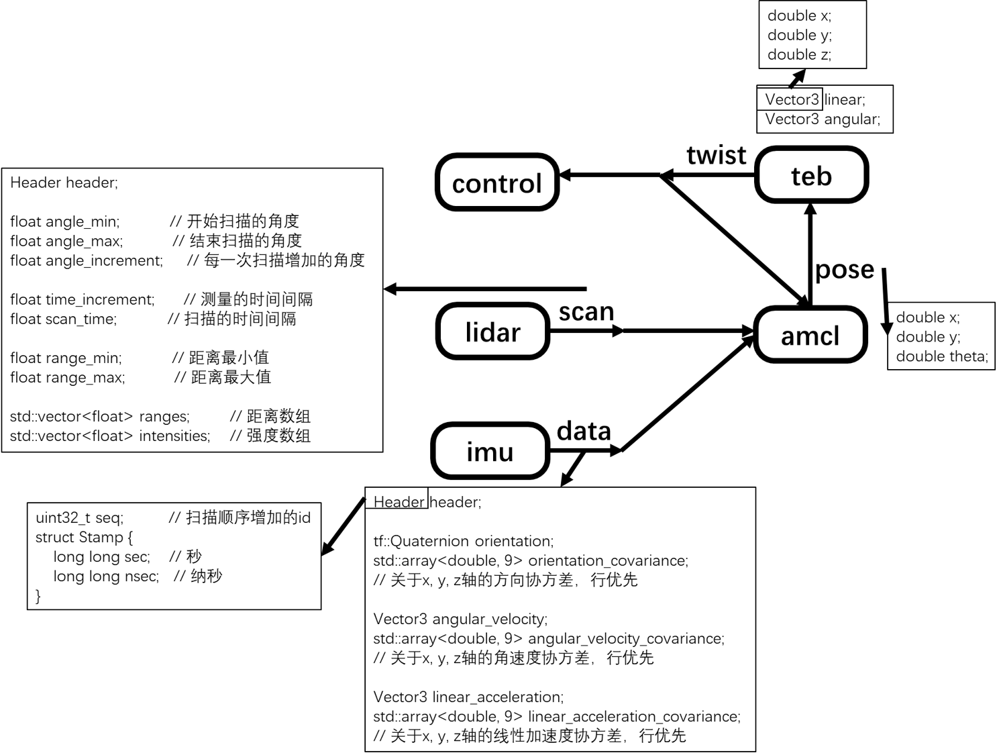

## 前置安装
### dora安装
```sh
cd ~ && git clone https://github.com/dora-rs/dora/
...
```
### imu节点
```sh
mkdir build && cd build
cmake ..
make
```
连接上串口后要`sudo chmod 777 /dev/ttyUSB0`

### lidar节点
lidar为镭神16线激光雷达，官方驱动网址为https://github.com/Lslidar/Lslidar_ROS1_driver.git

设置有线连接为手动
地址为192.168.1.102
子网掩码为255.255.255.0
网关为1.1.1.1

```sh
cd build/lidar
mkdir build && cd build
cmake ..
make
```

#### 调试雷达？
##### 方案一
可以参考官网的ros驱动版本
##### 方案二
可以参考笔者去ros化版本，仓库地址https://github.com/SUNNYsyy2005/Lslidar_non_ros/


### slam节点
```sh
cd build/slam
make install
cd build
cmake ..
make
```

### nav节点
```sh
cd build/nav
make install
```

### teb节点
```sh
cd build/teb
mkdir build && cd build
cmake ..
make
```

### amcl节点

```sh
cd build/amcl
mkdir build && cd build
cmake ..
make
```

### control节点
```sh
cd control && cargo build
```
连接上串口后要`sudo chmod 777 /dev/ttyUSB1`

## slam建图
#### 运行
```sh
dora start slamflow.yml
```
#### 代码说明
slam建图代码主要在build/slam目录下

##### 雷达里程计日志生成 
main.cc文件

该文件主要是接收lidar节点的消息，结合imu对机器人位姿估计的消息(暂无)，输出laser_data.dat日志文件

##### 建图  
log2pgm.cc文件

该文件主要是根据laser_data.dat日志文件信息，采用slam方法建图
###### 运行

```sh
make run
```

注：该代码改自https://github.com/simondlevy/BreezySLAM/

## 机器人导航
```sh
dora start dataflow.yml
```
### 定位
机器人定位的代码主要在amcl目录下，main.cc文件为起始文件

该部分代码根据lidar节点信息和imu节点提供的机器人朝向估计，采用amcl算法估计机器人在地图的实时坐标

注：该代码改自https://github.com/ysuga/navigation_amcl/tree/master


### 导航

#### 全局路径规划
机器人全局路径规划的代码主要在nav目录下，main.cc文件为起始文件

该部分代码对起始点和目标点之间路径采用A*算法进行全局规划，生成path.csv文件

注：该代码改自https://github.com/wql9/Navigation-planning-in-dynamic-and-static-environment/
##### 设置目标点

```sh
cd build/nav
make run 400 400 300 300
```
前两个参数为起始点坐标(默认为400 400，即图片最中间)

后两个参数为目标点坐标(默认为200 250)


以下几种命令都正确
```sh
make run #都使用默认值
make run 300 300 #只设置目标点
```


#### 局部路径规划 main.cc文件
机器人局部路径规划的代码主要在teb目录下，main.cc文件为起始文件

该部分代码根据lidar节点提供障碍物信息和amcl节点提供的实时坐标，采用teb算法对全局路径中过程点之间路径进行实时规划

注：该代码改自https://github.com/wushichatong/teb_local_planner_no_ros


## 脚本解释
`compile.sh`是用来编译dataflow.yml里面的所有节点的，在编译环境配置好的情况下可以使用<br><br>
`start.sh`用来加串口权限，需要`sudo`运行<br><br>
`replace_path.sh`是修改代码中一些绝对路径中的用户名，在使用前需要先进行修改成自己的用户名<br><br>   


             